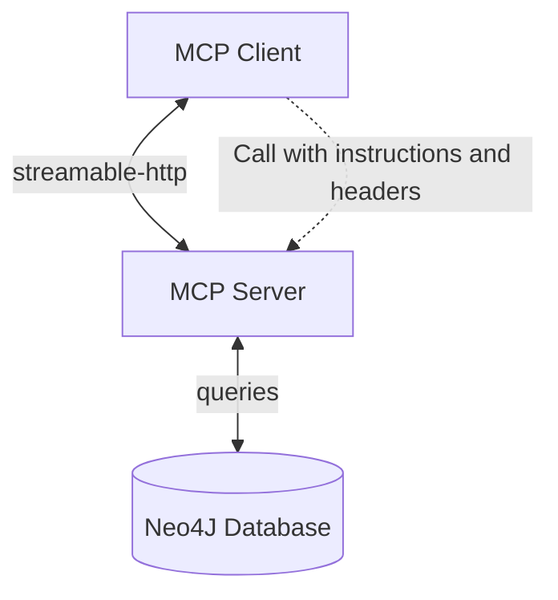
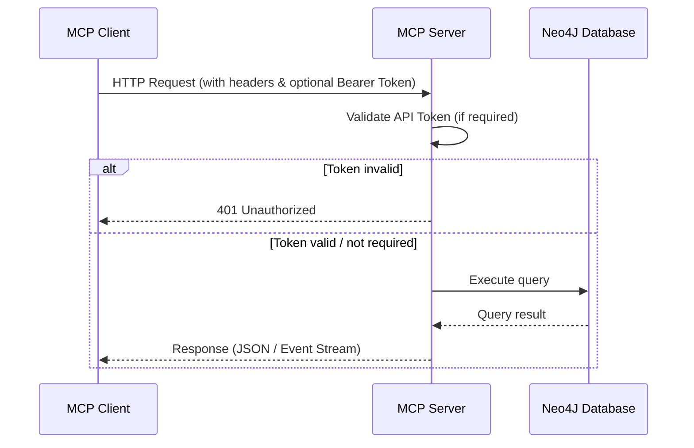

# MCP Server Template

A minimal template for running an **MCP (Model Context Protocol) server** with support for authentication, Neo4J integration through **Graphiti** framework, and containerization. Built using **FastMCP**.


## 🚀 Features

* 🔑 **Basic Authentication** (via API token)
* 🗄 **Neo4J database** integration
* 🌐 **HTTP server** for MCP transport
* 📦 **Containerization** with Docker & Docker Compose


## 🐳 Getting Started with Containers

### Option 1: Run server + database (recommended for testing)

```bash
docker compose up
```

> **Note**: You will need to set environment variables in your system


### Option 2: Run server only

```bash
docker build -t mcp-server .
docker run -p 8000:8000 mcp-server
```

> **Note**: You will need to set environment variables in .env file.

## 🔨 Local Development

Running project locally will require python 3.11 or higher.

`uv sync` -Install packages. Read more about it [here](https://docs.astral.sh/uv/).

`cd src` - move to project root

`python -m server` - run server (don't forget to set `.env` file)


## ⚙️ Environment Variables

The server is configured using environment variables.

OPENAI_BASE_URL=
OPENAI_API_KEY=

| Variable          | Required | Description                                                                            |
| ----------------- | -------- | -------------------------------------------------------------------------------------- |
| `API_TOKEN`       | ❌       | API token for basic authentication. If provided, clients must include it in requests.  |
| `NEO4J_URI`       | ✅       | Neo4J connection string                                                                |
| `NEO4J_USER`      | ✅       | Neo4J username                                                                         |
| `NEO4J_PASS`      | ✅       | Neo4J password                                                                         |
| `OPENAI_BASE_URL` | ✅       | Base URL for OpenAI API                                                                |
| `OPENAI_API_KEY`  | ✅       | API key for OpenAI API                                                                 |

👉 When working locally, create a `.env` file in the project root (use `.env.example` as a template).

---

## 🔌 Connecting to MCP Client

* Local: `http://localhost:8000`
* Remote: `http://<your-server-domain>`


### Authentication

If `API_TOKEN` is set, include it in your request headers:

```
Authorization: Bearer ${API_TOKEN}
```

### Required Headers

```
Content-Type: application/json
Accept: application/json, text/event-stream
```

## 📐 Prompt examples

1. `get me record from table data where id is 3`
2. `get me all records from table data`
3. `get me all records from table data where name is "John Doe"`

## 📡 Transport Support

* ✅ Currently supports: **`streamable-http`**
* 🚧 Can be extended to support other MCP transports


## 🖼 Architecture Diagram



* **MCP Client** communicates with the server using HTTP (`streamable-http`).
* **MCP Server** handles authentication and queries.
* **Neo4J Database** stores and retrieves persistent data.
* Optional **API Token** can be used for secured communication.


## 🔄 Sequence Diagram (Request Flow)



## Related documents

* [FastMCP](https://gofastmcp.com/)
* [MCP Protocol](https://modelcontextprotocol.io/docs/getting-started/intro)
* [UV package manager](https://docs.astral.sh/uv/)
* [Graphiti](https://www.getzep.com/product/open-source/)
* [Neo4J](https://neo4j.com/)